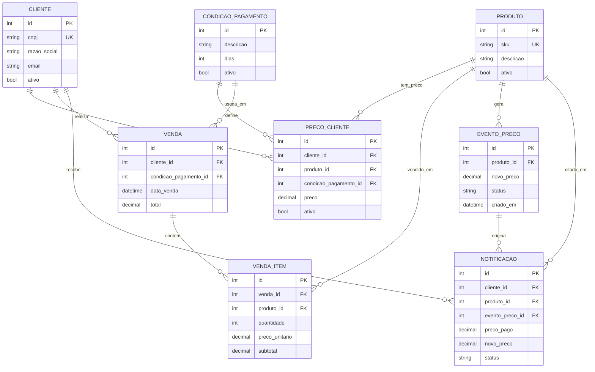

# Diagrama Entidade-Relacionamento proposto

## Entidades novas criadas

1. **precos_cliente**: representa a tabela de preços praticada por cliente, produto e condição de pagamento.
2. **vendas**: cabeçalho da venda realizada para um cliente.
3. **venda_itens**: produtos vendidos em cada venda, mantendo o preço praticado no momento da compra.
4. **eventos_preco**: fila de mensagens de alteração de preço, usada para não travar a requisição HTTP.
5. **notificacoes**: notificações geradas para clientes que compraram um produto por valor maior que o preço atual.
